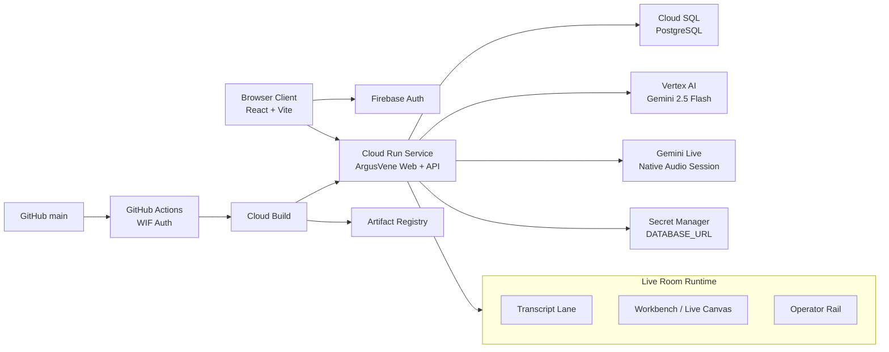

# ArgusVene Architecture

## Deployment boundary

- Public source of truth: [argusvene](https://github.com/seunghansung03-ship-it/argusvene)
- CI entrypoint: push to `main`
- Build system: Cloud Build
- Image registry: Artifact Registry
- Runtime: Cloud Run
- Database: Cloud SQL Postgres
- Model runtime: Vertex AI Gemini

## Why this shape fits the hackathon

- The model stack is Google-native
- The backend is hosted on Google Cloud
- The repository is public and reproducible
- The deployment path is automated and inspectable
